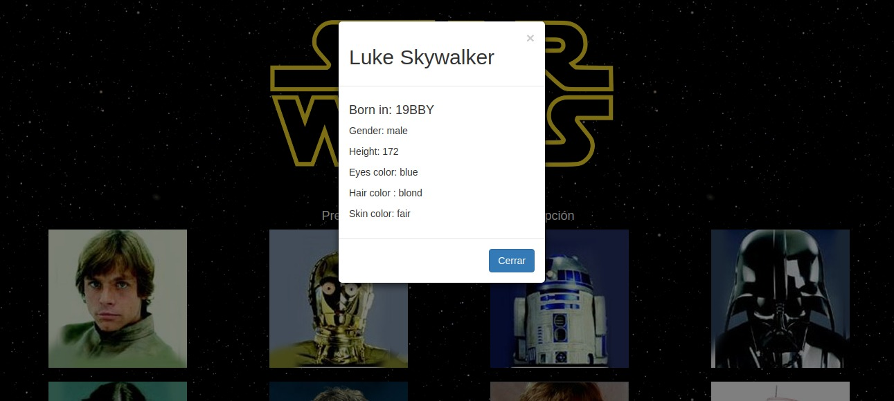
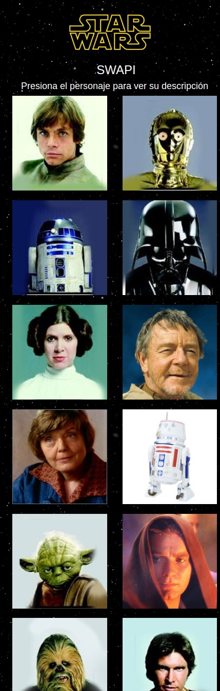

# SwapiApp

Es una aplicación que presionando al personaje y a través de un modal muestra los datos relevantes de los personajes de la saga Star Wars.

Se utilizó la Api "SWAPI" para obtener los datos.

Cuenta con version móvil.

Para realizar esta web se utilizó:

* Bootstrap 3
* JQuery 3.2.1
* Api SWAPI

#### Ejemplo de Versión web

#### Ejemplo de Versión web mostrando datos del personaje

#### Ejemplo de Versión móvil

### Autoras
 
[*Vanessa Martinez*](https://github.com/vanemarnava) & [*Carol Sepulveda*](https://github.com/carol-solivos)

### Desarrollado para 
[*Laboratoria*](http://www.laboratoria.la/)
